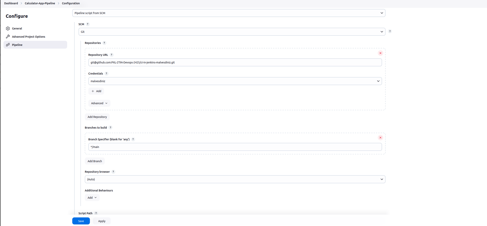
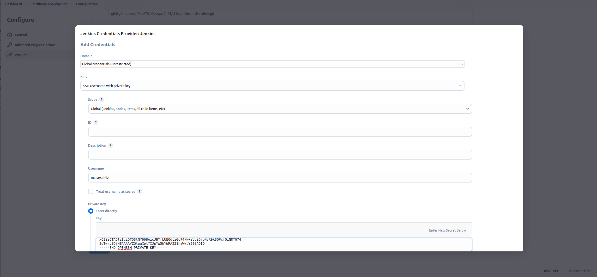
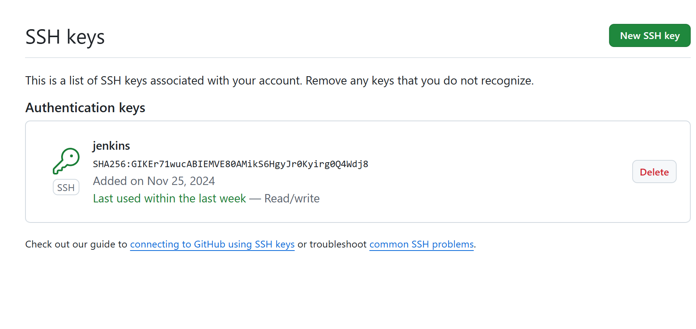
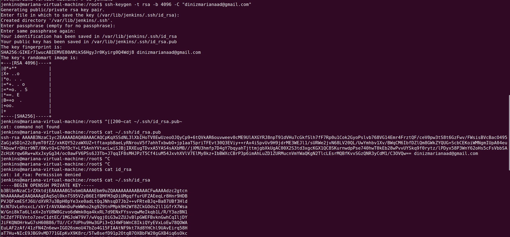

Vul onderstaande aan met de antwoorden op de vragen uit de readme.md file. Wil je de oplossingen file van opmaak voorzien? Gebruik dan [deze link](https://github.com/adam-p/markdown-here/wiki/Markdown-Cheatsheet) om informatie te krijgen over
opmaak met Markdown.

a)The first step to be able to use the Jenkinsfile from this repository was to create a pipeline where the script was associated with this file. 
The SSH link to the repository is then entered in the requested field and the branch to be used is specified.

Besides that, it is necessary that my Jenkins has authorized access to my repositories on GitHub. This is why a new authentication was created.
In the "Kind" field we specify that we will use an SSH username with private key and the GitHub account username is entered in the username field.
In the private key field we add our private key.

The important step to take into account is that in the private key field we have to provide a private key linked to a public key insert in an SSH key on github.

These keys were created in the terminal as shown in the screenshot below.

From now on, whenever the pipeline is built it will use the script in the Jenkinsfile file present in this repository.

b) 

c)

d)
