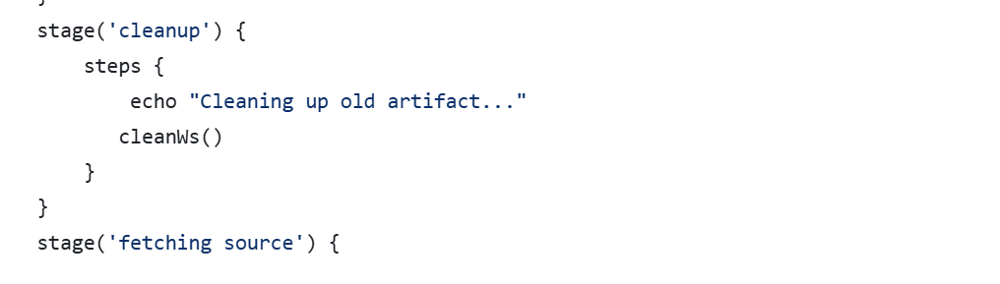

Vul onderstaande aan met de antwoorden op de vragen uit de readme.md file. Wil je de oplossingen file van opmaak voorzien? Gebruik dan [deze link](https://github.com/adam-p/markdown-here/wiki/Markdown-Cheatsheet) om informatie te krijgen over
opmaak met Markdown.

a)The first step to be able to use the Jenkinsfile from this repository was to create a pipeline where the script was associated with this file. 
The SSH link to the repository is then entered in the requested field and the branch to be used is specified.

Besides that, it is necessary that my Jenkins has authorized access to my repositories on GitHub. This is why a new authentication was created.
In the "Kind" field we specify that we will use an SSH username with private key and the GitHub account username is entered in the username field.
In the private key field we add our private key.

The important step to take into account is that in the private key field we have to provide a private key linked to a public key insert in an SSH key on github.

These keys were created in the terminal as shown in the screenshot below.

From now on, whenever the pipeline is built it will use the script in the Jenkinsfile file present in this repository.

b) 
First we install the pludin NodeJS as shown in the screenshot below.

We then install NodeJS 23.3.0 and configure it in Jenkins Global Tool Configuration called "TINnode-devops".

c)

Next we need to provide stage to fetch the source code from our personal GitHub repository on the main branch.

Then we create a stage “install dependencies” that will ensure that all npmdependencies of the application will be installed.

Then we add a stage “unit test” that will perform the unit tests of the application.This will allow to run unit tests using npm test.
junit 'junit.xml' is used for archiving JUnit test results and ensures the test framework generates the report as junit.xml

Next, add a stage 'create a bundle' that excludes unnecessary files and creates a bundle.zip with only the required files.

The next stage ensure failure handling. It writes a failure log with the date and time to /var/lib/jenkins/jenkinserrorlog.

Finally, archiving artifacts.
Archives the bundle.zip as a build artifact when the pipeline runs successfully.

Not, quite finally yet!
To ensure the pipeline can be executed multiple times without errors, the following adjustments were made:
Before creating a new bundle, clean up any existing artifacts to avoid conflicts.

d)
